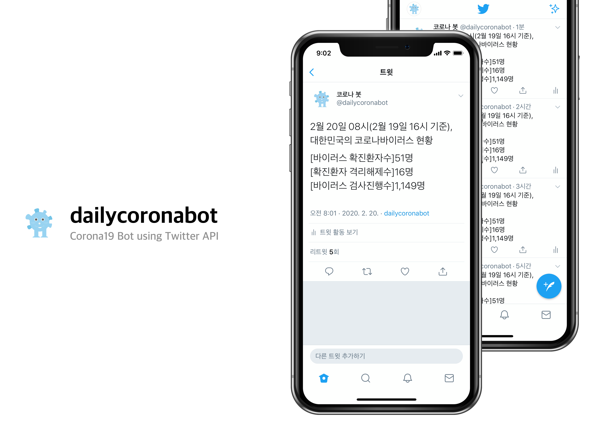

  

<h1 align="center">
  dailycoronabot
</h1>

<h3 align="center">
  🦠⚙️🤖
</h3>

<h3 align="center">
  Corona19 Bot using Twitter API
</h3>

  dailycoronabot is a twitter bot that informs the status of the coronavirus in South Korea

   
  
  
  

  

## 📝 License

Licensed under the [MIT License](LICENSE).
